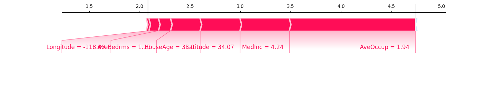
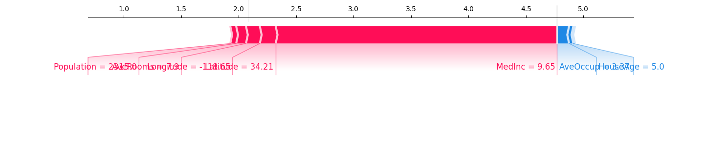

# Rapport de Projet MLOps : Prédiction de prix immobiliers en Californie

## Introduction
Ce projet vise à prédire le prix médian des maisons en Californie en utilisant une approche MLOps structurée. Nous travaillons avec les données `California Housing` fournies par `sklearn`.

## Objectifs
1. Introduire les concepts MLOps pour la gestion complète du cycle de vie d’un modèle.
2. Développer un modèle performant pour prédire le prix médian des maisons.
3. Mettre en place une solution de mise en production et de suivi du modèle.

## Étapes du Projet

### Mission 1 : Exploration et préparation des données

#### Détection et gestion des valeurs aberrantes
Lors de l'analyse des données, des seuils logiques ont été définis pour détecter et filtrer les valeurs aberrantes dans certaines colonnes. Ces seuils ont été établis en tenant compte des caractéristiques réalistes des maisons.

##### Méthodologie
1. **Seuils définis :**
   - `AveRooms` (nombre moyen de pièces par logement) : \( \leq 15 \).
   - `AveBedrms` (nombre moyen de chambres par logement) : \( \leq 6 \).
   - `AveOccup` (nombre moyen d'occupants par logement) : \( \leq 10 \).

2. **Critères :**
   - Les valeurs dépassant ces seuils ont été considérées comme aberrantes et retirées du jeu de données.

##### Résultats
- Nombre de valeurs aberrantes détectées :
  - **AveRooms** : 109 valeurs aberrantes.
  - **AveBedrms** : 28 valeurs aberrantes.
  - **AveOccup** : 37 valeurs aberrantes.
  
- Après filtrage, le jeu de données est passé de **20,640** lignes à **20,495** lignes.

##### Résumé statistique après filtrage
Les statistiques descriptives des données après gestion des valeurs aberrantes sont les suivantes :

| Statistique       | MedInc    | HouseAge  | AveRooms  | AveBedrms | Population | AveOccup | Latitude  | Longitude |
|-------------------|-----------|-----------|-----------|-----------|------------|----------|-----------|-----------|
| **Moyenne**       | 3.871     | 28.70     | 5.31      | 1.07      | 1428.90    | 2.92     | 35.62     | -119.57   |
| **Écart-type**    | 1.897     | 12.57     | 1.32      | 0.16      | 1128.38    | 0.77     | 2.13      | 2.00      |
| **Minimum**       | 0.50      | 1.00      | 0.85      | 0.33      | 3.00       | 0.75     | 32.54     | -124.35   |
| **25e percentile**| 2.56      | 18.00     | 4.44      | 1.01      | 792.00     | 2.43     | 33.93     | -121.80   |
| **Médiane**       | 3.54      | 29.00     | 5.22      | 1.05      | 1170.00    | 2.82     | 34.25     | -118.49   |
| **75e percentile**| 4.75      | 37.00     | 6.03      | 1.10      | 1727.00    | 3.28     | 37.71     | -118.01   |
| **Maximum**       | 15.00     | 52.00     | 14.85     | 3.72      | 35,682.00  | 9.95     | 41.95     | -114.31   |

#### Conclusion
Le filtrage des valeurs aberrantes a permis de nettoyer les données tout en conservant les informations pertinentes pour la modélisation. Ce processus a réduit le risque de biais induit par des valeurs extrêmes non représentatives.

### **Mission 2 : Modélisation et tracking des expériences**

#### **Objectif**
L'objectif de cette mission était de construire plusieurs modèles de régression afin de prédire le prix médian des maisons en Californie et de suivre les performances des modèles grâce à MLflow. Cette étape vise également à identifier le meilleur modèle pour une utilisation future.

#### **Étapes réalisées**

1. **Configuration de MLflow :**
   - Un environnement MLflow a été configuré pour suivre les expériences.
   - L'expérience a été nommée **California_Housing_Experiment**, et les métriques principales suivies étaient :
     - **RMSE** (Root Mean Squared Error)
     - **MAE** (Mean Absolute Error)
     - **R²** (Coefficient de détermination)

2. **Modèles testés :**
   3 modèles ont été entraînés et évalués :
   - **Régression linéaire** : Modèle baseline pour établir un point de référence.
   - **Random Forest** : Algorithme d'ensemble basé sur des arbres de décision.
   - **Gradient Boosting** : Méthode itérative qui optimise un modèle basé sur des erreurs résiduelles.

3. **Suivi des expériences avec MLflow :**
   - Chaque modèle a été entraîné dans une session distincte de MLflow.
   - Les hyperparamètres des modèles ainsi que les métriques de performance ont été enregistrés automatiquement dans MLflow.

4. **Résultats des modèles :**
   Voici les performances des différents modèles :

   | Modèle               | RMSE  | MAE  | R²   |
   |----------------------|-------|------|------|
   | Linear Regression    | 0.67  | 0.50 | 0.65 |
   | Random Forest        | 0.50  | 0.33 | 0.81 |
   | Gradient Boosting    | 0.52  | 0.36 | 0.79 |


#### **Analyse et sélection du meilleur modèle**
- Le modèle **Random Forest** a obtenu les meilleures performances avec :
  - **RMSE : 0.50**
  - **MAE : 0.33**
  - **R² : 0.81**
- Ce modèle a été sélectionné comme le meilleur modèle pour cette étape.

#### **Enregistrement du meilleur modèle**
Le modèle **Random Forest** a été enregistré dans le **Model Registry** de MLflow sous le nom **California_Housing_Best_Model** pour une utilisation future (document `choixModele.py`). Cela permettra de le recharger facilement pour des prédictions ou de futures analyses.

#### **Conclusion**
Cette étape a permis de tester et d’évaluer différents algorithmes de régression. Grâce à MLflow, nous avons pu comparer les performances de chaque modèle et identifier le modèle Random Forest comme étant le plus performant. Ce modèle sera utilisé pour les prochaines étapes du projet.


### **Mission 3 : Analyse des features**

#### **Objectif**
L'objectif de cette mission était de comprendre l'impact des différentes variables explicatives sur les prédictions du modèle. Cette analyse a été effectuée à deux niveaux :
1. **Impact global** : Importance moyenne des variables sur toutes les prédictions.
2. **Impact local** : Influence des variables sur les prédictions spécifiques pour des exemples individuels.

#### **Étapes réalisées**

1. **Analyse des importances globales des features :**
   - Utilisation de la bibliothèque **SHAP (SHapley Additive exPlanations)** pour calculer les importances globales des variables.
   - Le graphique généré montre les variables triées par leur impact moyen sur les prédictions :
     - **MedInc (Median Income)** est la variable la plus influente globalement.
     - Les variables géographiques (**Latitude** et **Longitude**) jouent également un rôle significatif.
     - D'autres variables comme **AveOccup** (moyenne d'occupation) et **HouseAge** (âge médian des maisons) ont une importance secondaire.

   **Graphique d'importances globales :**
   

   - Ce graphique met en évidence que **le revenu médian (MedInc)** est un facteur clé pour prédire le prix des maisons, ce qui est cohérent avec la réalité économique.

2. **Analyse des impacts locaux :**
   - étude de trois exemples aléatoires pour analyser comment les variables influencent les prédictions individuelles.
   - Pour chaque exemple, un graphique SHAP interactif (**force plot**) a été généré, montrant :
     - **Les variables qui augmentent la prédiction** (barres rouges).
     - **Les variables qui diminuent la prédiction** (barres bleues).
     - La valeur moyenne de référence (**baseline**) et la prédiction finale.

   **Exemples analysés :**

   - **Exemple 1 (Index : 1782)** :
     - **Longitude** et **Latitude** ont contribué positivement à l'augmentation de la prédiction.
     - **MedInc** (4.24) et **AveOccup** (1.94) jouent également un rôle important.

     

   - **Exemple 2 (Index : 8239)** :
     - **MedInc** (9.65) a fortement augmenté la prédiction.
     - En revanche, **AveOccup** et **HouseAge** ont diminué la prédiction.

     

   - **Exemple 3 (Index : 11317)** :
     - **Latitude** et **MedInc** ont réduit la prédiction.
     - **AveRooms** et **AveOccup** ont eu des impacts plus faibles.

     


#### **Résultats clés**

1. **Impact global :**
   - **MedInc** est la variable la plus influente pour le modèle, suivie des variables géographiques (**Latitude** et **Longitude**).
   - Les autres variables comme **AveOccup** et **HouseAge** jouent un rôle modéré.

2. **Impact local :**
   - Les contributions des variables varient selon les exemples. Par exemple :
     - Dans certains cas, **MedInc** est le facteur dominant.
     - Dans d'autres cas, des variables comme **Latitude** ou **AveOccup** ont un impact plus significatif.

3. **Résumé :**
   - Le modèle semble accorder une importance logique et cohérente aux variables, reflétant les facteurs économiques et géographiques influençant les prix des maisons en Californie.

### **Mission 4 : Mise en production**

#### **Création de l'API**
**Objectif**
L'objectif de cette étape était de rendre le modèle de prédiction accessible via une **API REST**. Cette API permet de recevoir les caractéristiques d'une maison en entrée et de retourner une prédiction du prix médian des maisons en Californie.

**Étapes réalisées**

1. **Création de l'API :**
   - Le code de l'API a été implémenté dans le fichier **`main_californiaHousing.py`** en utilisant **FastAPI**.
   - L'API charge le modèle **Random Forest** depuis **MLflow** et utilise les données reçues pour effectuer une prédiction.

2. **Fonctionnement de l'API :**
   - L'API accepte les caractéristiques de la maison sous forme de JSON (exemple : Revenu médian, Âge des maisons, Nombre moyen de pièces, Latitude, etc.).
   - Elle retourne une réponse JSON contenant la prédiction du prix médian.

3. **Lancement et test de l'API :**
   - L'API a été lancée localement avec **Uvicorn**.
  
4. **Exemple de réponse de l'API :**
   - Requête envoyée à l'API :
     ```json
     { 
       "MedInc": 3.5,
       "HouseAge": 20.0,
       "AveRooms": 6.0,
       "AveBedrms": 1.2,
       "Population": 1000.0,
       "AveOccup": 3.0,
       "Latitude": 34.0,
       "Longitude": -118.0
     }
     ```
   - Réponse reçue :
     ```json
     {
       "prediction": 2.1049400000000005
     }
     ```

**Résultat**
L'API est fonctionnelle et permet de recevoir des données d'entrée, d'effectuer une prédiction avec le modèle, et de retourner le résultat sous forme de réponse JSON.

#### **Conteneurisation avec Docker**

**Objectif**
L'objectif de cette étape était de conteneuriser l'API développée avec **FastAPI** afin de la rendre portable et facile à déployer dans différents environnements. La conteneurisation garantit que l’API fonctionne de manière cohérente indépendamment de la machine ou du système d'exploitation utilisé.

**Étapes réalisées**

**1. Création du fichier Dockerfile**
- Un fichier **`Dockerfile`** a été ajouté à la racine du projet pour spécifier les étapes nécessaires à la construction de l’image Docker.
- Le contenu du fichier permet :
  - De copier le code source de l’API dans le conteneur.
  - D’installer toutes les dépendances nécessaires depuis un fichier **`requirements.txt`**.
  - D’exposer le port 8000 pour permettre l’accès à l’API.
  - De démarrer l’API avec **Uvicorn**.

Voici le contenu du **Dockerfile** :
```dockerfile
FROM python:3.11-slim

WORKDIR /app

COPY . /app/

RUN pip install --no-cache-dir -r requirements.txt

EXPOSE 8000

CMD ["uvicorn", "main_californiaHousing:app", "--host", "0.0.0.0", "--port", "8000"]
```

**2. Ajout des dépendances dans requirements.txt**
- Un fichier **`requirements.txt`** a été créé pour lister toutes les dépendances nécessaires au fonctionnement de l’API :
  ```
  pandas
  numpy
  mlflow
  fastapi
  uvicorn
  pydantic
  shap
  scikit-learn
  matplotlib
  streamlit
  pytest
  poetry
  evidently
  ```

**3. Construction et exécution de l’image Docker**
- Les commandes utilisées pour construire et exécuter l’image Docker sont :
  ```bash
  docker build -t housing-prediction-api .
  docker run -d -p 8000:8000 housing-prediction-api
  ```

**Difficultés rencontrées**

**Installation et configuration de Docker Desktop**
Je n'ai pas réussi à installer Docker Desktop pour cette étape, j'ai donc du passer par Colima.

**Résultats**

1. **API conteneurisée :**
   - Une fois Docker configuré, l’API a été conteneurisée avec succès.

2. **Exécution locale :**
   - Le conteneur Docker a été exécuté localement et l’API était accessible via :
     ```
     http://localhost:8000/docs
     ```

3. **Portabilité garantie :**
   - Le projet est désormais indépendant de l’environnement local grâce à la conteneurisation.

**Conclusion**
Malgré les difficultés rencontrées lors de l’installation et de la configuration de Docker, la conteneurisation de l’API a été réalisée avec succès. 

#### **Créer une interface utilisateur locale avec Streamlit pour tester l’API**
**Objectif**
Développer une interface utilisateur locale pour tester l’API de prédiction.

**Étapes réalisées**
1. **Création d’une application Streamlit :**
   - Un formulaire a été créé pour saisir les caractéristiques d’une maison.
   - Les données sont envoyées à l’API via une requête POST.
   - La réponse de l’API est affichée sous forme de prix prédictif.

2. **Lancement de l’interface :**
   - L’application Streamlit est lancée localement à l’aide de la commande :
     ```bash
     streamlit run interface_streamlit.py
     ```

3. **Résultat :**
   - Une interface simple et intuitive permet de tester l’API en temps réel.

### **Mission 5 : Approche MLOps Avancée**

#### **Objectif**

L’objectif de cette mission est de mettre en pratique les bonnes pratiques MLOps en automatisant l’intégration et le déploiement (CI/CD) de l'API de prédiction via GitHub Actions. 

#### **Étapes réalisées**

1. **Configuration de GitHub Actions**

- Un fichier **`CI/CD Pipeline for California Housing Project`** (`.github/workflows/ci-cd.yml`) a été créé pour définir les étapes suivantes :  
  1. **Checkout** du code (avec support de Git LFS pour récupérer le modèle).  
  2. **Installation** des dépendances Python (requirements).  
  3. **Démarrage du serving MLflow** (pour charger le modèle Random Forest localement).  
  4. **Lancement** de l’API FastAPI via Uvicorn (port 8000).  
  5. **Vérification** de l’endpoint `/health` pour s’assurer que l’API est fonctionnelle.  
  6. **Exécution** des tests Pytest (`test_api.py`).  
  7. **Arrêt** des processus MLflow et Uvicorn.

Le pipeline se déclenche automatiquement lors d’un **push** ou d’une **pull request** sur la branche `main`.

2. **Mise en place des tests unitaires et d’intégration**

- Les **tests** sont regroupés dans un fichier dédié, par exemple `tests/test_api.py`.  
- Les scénarios testés incluent :  
  1. **Test de prédiction valide** : Vérifier qu’une requête bien formée retourne un code `200` et un champ `prediction` de type float. 
  2. **Valeurs extrêmes** (très petites ou très grandes) : S’assurer que l’API ne plante pas et retourne une prédiction float.  
  3. **Payloads invalides** : Tester les réponses 400/422 quand des champs sont manquants ou de type incorrect.  
  4. **État de santé** : Vérifier que `/health` retourne bien `{"status": "UP"}`.

- L’utilisation de **Pytest** permet d’exécuter automatiquement tous les tests et de lever une erreur si l’un d’eux échoue.

3. **Démarrage simultané du serveur MLflow et de l’API FastAPI**

1. *MLflow* :  
   - Le pipeline lance la commande :  
     ```bash
     mlflow models serve \
       --model-uri "./mlruns/196678121596541976/3e983990f0f940c9833110571636c3ba/artifacts/model" \
       --env-manager local \
       --host 0.0.0.0 \
       --port 5000 &
     sleep 30
     ```
   - Cette commande démarre le serveur MLflow, rendant le modèle accessible sur le port 5000.  
   - L’option `--env-manager local` évite la création d’un virtualenv supplémentaire et utilise l’environnement Python déjà présent.

2. *FastAPI* :  
   - L’API (`main_tests.py`) est ensuite lancée via :  
     ```bash
     uvicorn main_tests:app --host 0.0.0.0 --port 8000 &
     sleep 20
     ```
   - La variable `model_path` (dans `main_tests.py`) pointe vers le même dossier local que celui utilisé par MLflow, assurant la cohérence.

4. **Exécution des tests et arrêt des services**

- Une fois l’API disponible, on effectue une requête sur `/health` pour vérifier son statut.  
- Si l’API répond “UP”, on lance :  
  ```bash
  poetry run pytest tests/test_api.py -v
  ```
  (ou directement `pytest tests/test_api.py -v` selon votre configuration).  

- En cas de succès, le pipeline se termine en succès (build vert). Si un test échoue, GitHub Actions signale l’échec (build rouge).  
- À la fin, un script **`kill`** arrête les processus Uvicorn et MLflow pour libérer les ports et ressources :

  ```bash
  kill $(ps aux | grep 'uvicorn\|mlflow' | grep -v grep | awk '{print $2}')
  ```
  
5. **Résultats et bénéfices**

1. *Cycle de vie automatisé* : À chaque push, GitHub Actions :  
   - Télécharge le code et le modèle.  
   - Installe l’environnement.  
   - Lance MLflow et l’API.  
   - Exécute les tests.  
   - Fournit un statut de build (Succès/Échec).

2. *Qualité du code et fiabilité* : Les tests unitaires garantissent que l’API répond bien aux appels, gère les erreurs et retourne des valeurs attendues.  

3. *Traçabilité et rapidité* : En cas d’erreur, il est facile d’identifier la cause via les logs du pipeline. Les développeurs peuvent corriger le code et republier.  

4. *Préparation au déploiement* : Ce pipeline est un socle pour aller plus loin (par exemple, déployer automatiquement sur un service cloud après validation des tests).

#### **Difficultés rencontrées**
J'ai rencontré des difficultés dans la mise en place des tests et plus précisément au niveau du lancement de mlflow et de l'api. Je n'arrivais pas à push mes model.pkl qui se trouvaient dans mon dossier mlruns, donc j'ai du passer par Git LFS (Large File Storage) pour pouvoir avoir des tests qui aboutissent.

### Mission 6 : Suivi en production

#### **Objectif**

L’objectif de cette mission est de **surveiller les performances du modèle en production** et de **détecter d’éventuelles dérives** (data drift) par rapport aux données d’entraînement. Nous cherchons notamment à :

1. **Simuler** des données de production pour reproduire un contexte réaliste.
2. **Utiliser** **Evidently** afin de détecter le drift entre les données d’entraînement et ces nouvelles données.
3. **Analyser** le rapport de drift et proposer des solutions pour réentraîner ou ajuster le modèle si nécessaire.

#### **Étapes réalisées**
1. **Simulation de données de production**

- Un script `simulation.py` a été développé pour **générer artificiellement** un jeu de données de production.
- La fonction `generate_production_data()` crée un DataFrame avec une distribution réaliste (mais légèrement différente) pour chacune des features suivantes :
  - `MedInc`, `HouseAge`, `AveRooms`, `AveBedrms`, `Population`, `AveOccup`, `Latitude`, `Longitude`.

> **Exemple d’appel :**
> ```python
> production_data = generate_production_data(num_samples=1000)
> ```

Le but est de **simuler** l’évolution potentielle des données au fil du temps en production.

2. **Chargement des données d’entraînement**
- Les données d’entraînement sont chargées depuis un fichier CSV existant, par exemple `X_train.csv`.
- Ces données représentent la **référence** (les données initiales qui ont servi à entraîner le modèle).

3. **Détection du data drift avec Evidently**

- La bibliothèque **Evidently** fournit des métriques de comparaison entre deux distributions de données (d’entraînement vs. production).
- Un rapport Evidently a été créé via :
  ```python
  from evidently.report import Report
  from evidently.metric_preset import DataDriftPreset

  data_drift_report = Report(metrics=[DataDriftPreset()])
  data_drift_report.run(reference_data=training_data, current_data=production_data)
  data_drift_report.save_html("data_drift_report.html")
  ```
- Cette étape **génère un rapport HTML** détaillant :
  - Les features dont la distribution a significativement changé.
  - Des mesures de distances (ex.: **Wasserstein distance**).
  - Un **indicateur global** indiquant si le data drift est détecté.

4. **Résultats et constat**

D’après le rapport Evidently :

> **“Dataset Drift is detected. Drift is detected for 100% of columns.”**  
> - Toutes les colonnes sont considérées comme “driftées” par rapport au jeu de données d’entraînement.  
> - Les distances mesurées varient selon les colonnes, avec un écart plus marqué pour `Population`, `AveBedrms` et `Latitude`.  

Cela signifie que les données actuelles (simulées) diffèrent fortement des distributions initiales utilisées pour l’entraînement. Dans un contexte réel, un tel constat implique que **les performances du modèle** peuvent se dégrader si la distribution des données se modifie autant.

#### **Propositions de solutions en cas de drift significatif**

1. *Réentraînement (Retraining) du modèle* :  
   - Collecter un échantillon suffisant de nouvelles données réelles (ou simulées) reflétant la **distribution actuelle**.  
   - Mettre à jour le pipeline de features engineering si nécessaire.  
   - Réentraîner le modèle pour qu’il s’adapte aux nouvelles conditions.

2. *Approche de “Continuous Training”* :  
   - Mettre en place un processus automatisé détectant le drift.  
   - Déclencher un réentraînement selon un seuil défini (par exemple, si plus de 30% des features présentent une dérive au-delà d’un certain niveau).

3. *Échantillonnage et validation en continu* :  
   - Surveiller régulièrement la performance du modèle (métriques en production, tel que le RMSE ou MAE si la vérité terrain est disponible).  
   - Comparer ces métriques avec celles du training initial pour détecter une baisse de performance liée au drift.

#### **Conclusion**

Cette sixième mission a permis de **mettre en évidence** l’importance de **surveiller en continu** la cohérence entre les données d’entraînement et les données réelles en production. Grâce à **Evidently**, nous détectons rapidement les dérives de distribution et pouvons anticiper la perte de performance du modèle.  

## Références

- **Données** : [`California Housing` (sklearn)](https://scikit-learn.org/stable/modules/generated/sklearn.datasets.fetch_california_housing.html)  
- **Documentation Python** : [scikit-learn](https://scikit-learn.org)  
- **Documentation GitHub Actions** : [docs.github.com/actions](https://docs.github.com/actions)  
- **Documentation MLflow Models Serve** : [mlflow.org/docs/latest/cli.html#mlflow-models-serve](https://mlflow.org/docs/latest/cli.html#mlflow-models-serve)  
- **Documentation FastAPI – Deploying with Uvicorn** : [fastapi.tiangolo.com/deployment/](https://fastapi.tiangolo.com/deployment/)  
- **Documentation Pytest** : [docs.pytest.org/en/latest/](https://docs.pytest.org/en/latest/)  
- **Documentation Evidently** : [docs.evidentlyai.com](https://docs.evidentlyai.com/)  
- **Documentation MLflow – Tracking & Model Registry** : [mlflow.org/docs/latest/index.html](https://mlflow.org/docs/latest/index.html) 
