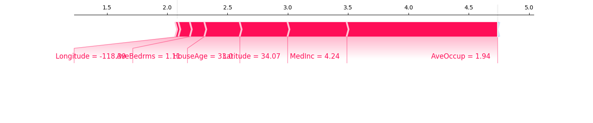
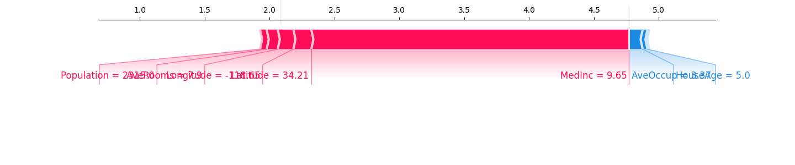
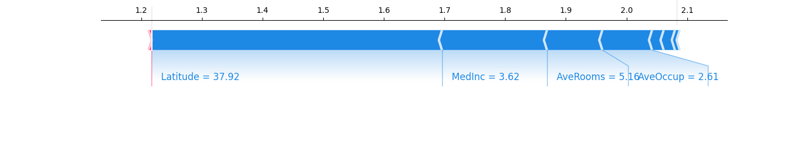

# Rapport de Projet MLOps : Prédiction de prix immobiliers en Californie

## Introduction
Ce projet vise à prédire le prix médian des maisons en Californie en utilisant une approche MLOps structurée. Nous travaillons avec les données `California Housing` fournies par `sklearn`.

## Objectifs
1. Introduire les concepts MLOps pour la gestion complète du cycle de vie d’un modèle.
2. Développer un modèle performant pour prédire le prix médian des maisons.
3. Mettre en place une solution de mise en production et de suivi du modèle.

## Étapes du Projet

Voici la section mise à jour pour ton rapport, avec les résultats précis inclus :

---

### Mission 1 : Exploration et préparation des données

#### Détection et gestion des valeurs aberrantes
Lors de l'analyse des données, des seuils logiques ont été définis pour détecter et filtrer les valeurs aberrantes dans certaines colonnes. Ces seuils ont été établis en tenant compte des caractéristiques réalistes des maisons.

##### Méthodologie
1. **Seuils définis :**
   - `AveRooms` (nombre moyen de pièces par logement) : \( \leq 15 \).
   - `AveBedrms` (nombre moyen de chambres par logement) : \( \leq 6 \).
   - `AveOccup` (nombre moyen d'occupants par logement) : \( \leq 10 \).

2. **Critères :**
   - Les valeurs dépassant ces seuils ont été considérées comme aberrantes et retirées du jeu de données.

##### Résultats
- Nombre de valeurs aberrantes détectées :
  - **AveRooms** : 109 valeurs aberrantes.
  - **AveBedrms** : 28 valeurs aberrantes.
  - **AveOccup** : 37 valeurs aberrantes.
  
- Après filtrage, le jeu de données est passé de **20,640** lignes à **20,495** lignes.

##### Résumé statistique après filtrage
Les statistiques descriptives des données après gestion des valeurs aberrantes sont les suivantes :

| Statistique       | MedInc    | HouseAge  | AveRooms  | AveBedrms | Population | AveOccup | Latitude  | Longitude |
|-------------------|-----------|-----------|-----------|-----------|------------|----------|-----------|-----------|
| **Moyenne**       | 3.871     | 28.70     | 5.31      | 1.07      | 1428.90    | 2.92     | 35.62     | -119.57   |
| **Écart-type**    | 1.897     | 12.57     | 1.32      | 0.16      | 1128.38    | 0.77     | 2.13      | 2.00      |
| **Minimum**       | 0.50      | 1.00      | 0.85      | 0.33      | 3.00       | 0.75     | 32.54     | -124.35   |
| **25e percentile**| 2.56      | 18.00     | 4.44      | 1.01      | 792.00     | 2.43     | 33.93     | -121.80   |
| **Médiane**       | 3.54      | 29.00     | 5.22      | 1.05      | 1170.00    | 2.82     | 34.25     | -118.49   |
| **75e percentile**| 4.75      | 37.00     | 6.03      | 1.10      | 1727.00    | 3.28     | 37.71     | -118.01   |
| **Maximum**       | 15.00     | 52.00     | 14.85     | 3.72      | 35,682.00  | 9.95     | 41.95     | -114.31   |

#### Conclusion
Le filtrage des valeurs aberrantes a permis de nettoyer les données tout en conservant les informations pertinentes pour la modélisation. Ce processus a réduit le risque de biais induit par des valeurs extrêmes non représentatives.

### **Mission 2 : Modélisation et tracking des expériences**

#### **Objectif**
L'objectif de cette mission était de construire plusieurs modèles de régression afin de prédire le prix médian des maisons en Californie et de suivre les performances des modèles grâce à MLflow. Cette étape vise également à identifier le meilleur modèle pour une utilisation future.

#### **Étapes réalisées**

1. **Configuration de MLflow :**
   - Un environnement MLflow a été configuré pour suivre les expériences.
   - L'expérience a été nommée **California_Housing_Experiment**, et les métriques principales suivies étaient :
     - **RMSE** (Root Mean Squared Error)
     - **MAE** (Mean Absolute Error)
     - **R²** (Coefficient de détermination)

2. **Modèles testés :**
   Cinq modèles ont été entraînés et évalués :
   - **Régression linéaire** : Modèle baseline pour établir un point de référence.
   - **Random Forest** : Algorithme d'ensemble basé sur des arbres de décision.
   - **Gradient Boosting** : Méthode itérative qui optimise un modèle basé sur des erreurs résiduelles.
   - **Support Vector Regression (SVR)** : Modèle basé sur des marges et des noyaux.
   - **K-Nearest Neighbors (KNN)** : Approche non paramétrique basée sur les voisins les plus proches.

3. **Suivi des expériences avec MLflow :**
   - Chaque modèle a été entraîné dans une session distincte de MLflow.
   - Les hyperparamètres des modèles ainsi que les métriques de performance ont été enregistrés automatiquement dans MLflow.

4. **Résultats des modèles :**
   Voici les performances des différents modèles :

   | Modèle               | RMSE  | MAE  | R²   |
   |----------------------|-------|------|------|
   | Linear Regression    | 0.67  | 0.50 | 0.65 |
   | Random Forest        | 0.50  | 0.33 | 0.81 |
   | Gradient Boosting    | 0.52  | 0.36 | 0.79 |
   | SVR                 | 1.07  | 0.83 | 0.13 |
   | KNN                 | 1.07  | 0.83 | 0.12 |

#### **Analyse et sélection du meilleur modèle**
- Le modèle **Random Forest** a obtenu les meilleures performances avec :
  - **RMSE : 0.50**
  - **MAE : 0.33**
  - **R² : 0.81**
- Ce modèle a été sélectionné comme le meilleur modèle pour cette étape.

#### **Enregistrement du meilleur modèle**
Le modèle **Random Forest** a été enregistré dans le **Model Registry** de MLflow sous le nom **California_Housing_Best_Model** pour une utilisation future. Cela permettra de le recharger facilement pour des prédictions ou de futures analyses.

#### **Conclusion**
Cette étape a permis de tester et d’évaluer différents algorithmes de régression. Grâce à MLflow, nous avons pu comparer les performances de chaque modèle et identifier le modèle Random Forest comme étant le plus performant. Ce modèle sera utilisé pour les prochaines étapes du projet.

Voici une rédaction complète pour la **Mission 3 : Analyse des features** à inclure dans ton rapport :

---

### **Mission 3 : Analyse des features**

#### **Objectif**
L'objectif de cette mission était de comprendre l'impact des différentes variables explicatives sur les prédictions du modèle. Cette analyse a été effectuée à deux niveaux :
1. **Impact global** : Importance moyenne des variables sur toutes les prédictions.
2. **Impact local** : Influence des variables sur les prédictions spécifiques pour des exemples individuels.

---

#### **Étapes réalisées**

1. **Analyse des importances globales des features :**
   - Nous avons utilisé la bibliothèque **SHAP (SHapley Additive exPlanations)** pour calculer les importances globales des variables.
   - Le graphique généré montre les variables triées par leur impact moyen sur les prédictions :
     - **MedInc (Median Income)** est la variable la plus influente globalement.
     - Les variables géographiques (**Latitude** et **Longitude**) jouent également un rôle significatif.
     - D'autres variables comme **AveOccup** (moyenne d'occupation) et **HouseAge** (âge médian des maisons) ont une importance secondaire.

   **Graphique d'importances globales :**
   

   - Ce graphique met en évidence que **le revenu médian (MedInc)** est un facteur clé pour prédire le prix des maisons, ce qui est cohérent avec la réalité économique.

2. **Analyse des impacts locaux :**
   - Nous avons étudié trois exemples aléatoires pour analyser comment les variables influencent les prédictions individuelles.
   - Pour chaque exemple, un graphique SHAP interactif (**force plot**) a été généré, montrant :
     - **Les variables qui augmentent la prédiction** (barres rouges).
     - **Les variables qui diminuent la prédiction** (barres bleues).
     - La valeur moyenne de référence (**baseline**) et la prédiction finale.

   **Exemples analysés :**

   - **Exemple 1 (Index : 1782)** :
     - **Longitude** et **Latitude** ont contribué positivement à l'augmentation de la prédiction.
     - **MedInc** (4.24) et **AveOccup** (1.94) jouent également un rôle important.

     

   - **Exemple 2 (Index : 8239)** :
     - **MedInc** (9.65) a fortement augmenté la prédiction.
     - En revanche, **AveOccup** et **HouseAge** ont diminué la prédiction.

     

   - **Exemple 3 (Index : 11317)** :
     - **Latitude** et **MedInc** ont réduit la prédiction.
     - **AveRooms** et **AveOccup** ont eu des impacts plus faibles.

     


#### **Résultats clés**

1. **Impact global :**
   - **MedInc** est la variable la plus influente pour le modèle, suivie des variables géographiques (**Latitude** et **Longitude**).
   - Les autres variables comme **AveOccup** et **HouseAge** jouent un rôle modéré.

2. **Impact local :**
   - Les contributions des variables varient selon les exemples. Par exemple :
     - Dans certains cas, **MedInc** est le facteur dominant.
     - Dans d'autres cas, des variables comme **Latitude** ou **AveOccup** ont un impact plus significatif.

3. **Insight général :**
   - Le modèle semble accorder une importance logique et cohérente aux variables, reflétant les facteurs économiques et géographiques influençant les prix des maisons en Californie.

Voici une version simplifiée pour ton rapport :

---

### **Mission 4 : Mise en production

#### Création de l'API**
**Objectif**
L'objectif de cette étape était de rendre le modèle de prédiction accessible via une **API REST**. Cette API permet de recevoir les caractéristiques d'une maison en entrée et de retourner une prédiction du prix médian des maisons en Californie.

**Étapes réalisées**

1. **Création de l'API :**
   - Le code de l'API a été implémenté dans le fichier **`main_californiaHousing.py`** en utilisant **FastAPI**.
   - L'API charge le modèle **Random Forest** depuis **MLflow** et utilise les données reçues pour effectuer une prédiction.

2. **Fonctionnement de l'API :**
   - L'API accepte les caractéristiques de la maison sous forme de JSON (exemple : Revenu médian, Âge des maisons, Nombre moyen de pièces, Latitude, etc.).
   - Elle retourne une réponse JSON contenant la prédiction du prix médian.

3. **Lancement et test de l'API :**
   - L'API a été lancée localement avec **Uvicorn**.
   - Les requêtes ont été testées via **Swagger UI** (documentation interactive générée automatiquement par FastAPI).

4. **Exemple de réponse de l'API :**
   - Requête envoyée à l'API :
     ```json
     { 
       "MedInc": 3.5,
       "HouseAge": 20.0,
       "AveRooms": 6.0,
       "AveBedrms": 1.2,
       "Population": 1000.0,
       "AveOccup": 3.0,
       "Latitude": 34.0,
       "Longitude": -118.0
     }
     ```
   - Réponse reçue :
     ```json
     {
       "prediction": 2.1049400000000005
     }
     ```

**Résultat**
L'API est fonctionnelle et permet de recevoir des données d'entrée, d'effectuer une prédiction avec le modèle, et de retourner le résultat sous forme de réponse JSON.

Voici une rédaction complète et adaptée pour la **partie Docker** de ton rapport, en prenant en compte les difficultés rencontrées :

---

#### **Conteneurisation avec Docker**
**Objectif**
L'objectif de cette étape était de conteneuriser l'API développée avec **FastAPI** afin de la rendre portable et facile à déployer dans différents environnements. La conteneurisation garantit que l’API fonctionne de manière cohérente indépendamment de la machine ou du système d'exploitation utilisé.

**Étapes réalisées**

**1. Création du fichier Dockerfile**
- Un fichier **`Dockerfile`** a été ajouté à la racine du projet pour spécifier les étapes nécessaires à la construction de l’image Docker.
- Le contenu du fichier permet :
  - De copier le code source de l’API dans le conteneur.
  - D’installer toutes les dépendances nécessaires depuis un fichier **`requirements.txt`**.
  - D’exposer le port 8000 pour permettre l’accès à l’API.
  - De démarrer l’API avec **Uvicorn**.

Voici le contenu du **Dockerfile** :
```dockerfile
FROM python:3.11-slim

WORKDIR /app

COPY . /app/

RUN pip install --no-cache-dir -r requirements.txt

EXPOSE 8000

CMD ["uvicorn", "main_californiaHousing:app", "--host", "0.0.0.0", "--port", "8000"]
```

**2. Ajout des dépendances dans requirements.txt**
- Un fichier **`requirements.txt`** a été créé pour lister toutes les dépendances nécessaires au fonctionnement de l’API :
  ```
  pandas
  numpy
  mlflow
  fastapi
  uvicorn
  pydantic
  shap
  scikit-learn
  matplotlib
  ```

**3. Construction et exécution de l’image Docker**
- Les commandes utilisées pour construire et exécuter l’image Docker sont :
  ```bash
  docker build -t housing-prediction-api .
  docker run -d -p 8000:8000 housing-prediction-api
  ```

**Difficultés rencontrées**

**1. Installation et configuration de Docker Desktop**
- Docker Desktop ne s’ouvrait pas correctement, empêchant l’utilisation du démon Docker. Cela a nécessité :
  - Une réinstallation complète de Docker Desktop.
  - La suppression manuelle des fichiers de configuration corrompus.
  - La vérification de la compatibilité avec le système (macOS et processeur M1/M2).
  - Une transition temporaire vers **Colima**, un gestionnaire Docker alternatif, avant que Docker Desktop ne fonctionne correctement.

**2. Accès au socket Docker (`docker.sock`)**
- Une erreur liée au fichier `docker.sock` a empêché Docker de fonctionner.
- Solution apportée :
  - Réinitialisation des permissions du fichier socket.
  - Redémarrage de Docker Desktop et du système pour relancer le démon Docker.

**Résultats**

1. **API conteneurisée :**
   - Une fois Docker configuré, l’API a été conteneurisée avec succès.
   - L’image Docker peut être partagée et déployée sur n’importe quel environnement compatible Docker.

2. **Exécution locale :**
   - Le conteneur Docker a été exécuté localement et l’API était accessible via :
     ```
     http://localhost:8000/docs
     ```

3. **Portabilité garantie :**
   - Le projet est désormais indépendant de l’environnement local grâce à la conteneurisation.

**Conclusion**
Malgré les difficultés rencontrées lors de l’installation et de la configuration de Docker, la conteneurisation de l’API a été réalisée avec succès. Cela marque une étape importante vers le déploiement potentiel du projet dans un environnement cloud.

#### **Créer une interface utilisateur locale avec Streamlit pour tester l’API**
**Objectif**
Développer une interface utilisateur locale pour tester l’API de prédiction.

**Étapes réalisées**
1. **Création d’une application Streamlit :**
   - Un formulaire a été créé pour saisir les caractéristiques d’une maison.
   - Les données sont envoyées à l’API via une requête POST.
   - La réponse de l’API est affichée sous forme de prix prédictif.

2. **Lancement de l’interface :**
   - L’application Streamlit est lancée localement à l’aide de la commande :
     ```bash
     streamlit run interface_streamlit.py
     ```

3. **Résultat :**
   - Une interface simple et intuitive permet de tester l’API en temps réel.

**Difficultés rencontrées**
- Assurer que l’API soit en cours d’exécution avant de lancer Streamlit.
- Gérer les erreurs de requêtes HTTP en cas de défaillance de l’API.

#### **Conclusion**
Cette analyse a permis de valider l'interprétabilité du modèle Random Forest. Les résultats montrent que le modèle est aligné avec des intuitions économiques et géographiques. Ces analyses, tant globales que locales, offrent des perspectives précieuses pour comprendre et justifier les prédictions.

## Conclusion

## Références
- Données : `California Housing` (sklearn).
- Documentation Python : [scikit-learn](https://scikit-learn.org).
